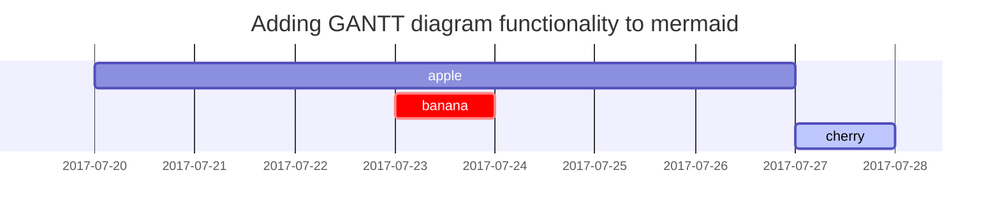

## 일반 텍스트 줄바꿈
공백 2번(작게)  
또는 Enter 1번(크게)

멀리 떨어짐

## Headings

<!-- markdownlint-capture -->
<!-- markdownlint-disable -->
# `#` H1 - heading
{: .mt-4 .mb-0 }

## `##` H2 - heading
{: data-toc-skip='' .mt-4 .mb-0 }

### `###` H3 - heading
{: data-toc-skip='' .mt-4 .mb-0 }

#### `####` H4 - heading
{: data-toc-skip='' .mt-4 }
<!-- markdownlint-restore -->

## Paragraph

Quisque egestas convallis ipsum, ut sollicitudin risus tincidunt a. Maecenas interdum malesuada egestas. Duis consectetur porta risus, sit amet vulputate urna facilisis ac. Phasellus semper dui non purus ultrices sodales. Aliquam ante lorem, ornare a feugiat ac, finibus nec mauris. Vivamus ut tristique nisi. Sed vel leo vulputate, efficitur risus non, posuere mi. Nullam tincidunt bibendum rutrum. Proin commodo ornare sapien. Vivamus interdum diam sed sapien blandit, sit amet aliquam risus mattis. Nullam arcu turpis, mollis quis laoreet at, placerat id nibh. Suspendisse venenatis eros eros.

## Lists

### Ordered list

1. `1.`Firstly
2. Secondly
3. Thirdly

### Unordered list

- `-`Chapter
  - Section
    - Paragraph

### ToDo list

- [ ] `-[ ]`
  - [x] `-[x]`
  - [x] Step 2
  - [ ] Step 3

### Description list

Sun
: `:`the star around which the earth orbits

Moon
: `:`the natural satellite of the earth, visible by reflected light from the sun

## Block Quote

> `>`This line shows the _block quote_.`\\`
> >`> >` 블럭 인용구에서 줄 바꿈은 끝에 \

## Prompts

<!-- markdownlint-capture -->
<!-- markdownlint-disable -->
> An example showing the `tip` type prompt.`{: .prompt-tip }`
{: .prompt-tip }

> An example showing the `info` type prompt. `{: .prompt-info }`
{: .prompt-info }

> An example showing the `warning` type prompt. `{: .prompt-warning }`
{: .prompt-warning }

> An example showing the `danger` type prompt. `{: .prompt-danger }`
{: .prompt-danger }
<!-- markdownlint-restore -->

## Tables

| Company                      | Contact          | Country |
| :--------------------------- | :--------------- | ------: |
| Alfreds Futterkiste          | Maria Anders     | Germany |
| Island Trading               | Helen Bennett    |      UK |
| Magazzini Alimentari Riuniti | Giovanni Rovelli |   Italy |

```
| Company                      | Contact          | Country |
| :--------------------------- | :--------------- | ------: |
| Alfreds Futterkiste          | Maria Anders     | Germany |
| Island Trading               | Helen Bennett    |      UK |
| Magazzini Alimentari Riuniti | Giovanni Rovelli |   Italy |
```

## Links

<http://127.0.0.1:4000>  
`<http://127.0.0.1:4000>`

## Footnote

Click the hook will locate the footnote[^footnote]`[^footnote]`, and here is another footnote[^fn-nth-2]`[^fn-nth-2]`.

## Inline code

This is an example of `Inline Code`.

## Filepath

Here is the `/path/to/the/file.extend`{: .filepath}.`{: .filepath}`

## Code blocks

### Common

```text
This is a common code snippet, without syntax highlight and line number.
```

### Specific Language

```bash
if [ $? -ne 0 ]; then
  echo "The command was not successful.";
  #do the needful / exit
fi;
```

### Specific filename

```sass
@import
  "colors/light-typography",
  "colors/dark-typography";
```
{: file='_sass/jekyll-theme-chirpy.scss'}

`{: file='_sass/jekyll-theme-chirpy.scss'}`

## Mathematics

The mathematics powered by [**MathJax**](https://www.mathjax.org/):

$$
\begin{equation}
  \sum_{n=1}^\infty 1/n^2 = \frac{\pi^2}{6}
  \label{eq:series}
\end{equation}
$$

We can reference the equation as \eqref{eq:series}.

When $a \ne 0$, there are two solutions to $ax^2 + bx + c = 0$ and they are

$$ x = {-b \pm \sqrt{b^2-4ac} \over 2a} $$

## Mermaid SVG



## 이미지

### 설명

이미지의 다음 줄에 이탤릭체를 추가하면, 설명이 이미지 맨 아래에 나타납니다:

```markdown

_Image Caption_
```
{: .nolineno}

### 크기

이미지를 로드할 때 페이지 콘텐츠 레이아웃이 이동하는 것을 방지하기 위해 각 이미지의 너비와 높이를 설정해야 합니다.

```markdown
{: width="700" height="400" }
```
{: .nolineno}

> SVG의 경우 적어도 _width_를 지정해야 합니다. 그렇지 않으면 렌더링되지 않습니다.
{: .prompt-info }

_Chirpy v5.0.0_ 버전부터는, `height` and `width` 축약어를 지원합니다. (`height` → `h`, `width` → `w`). 다음 예제는 위의 예와 동일한 효과를 같습니다:

```markdown
{: w="700" h="400" }
```
{: .nolineno}

### 위치

기본적으로 이미지는 중앙에 배치되지만, `normal`, `left`, `right` 중 하나를 사용하여 위치를 지정할 수 있습니다.

> 위치를 지정하면 이미지 설명이 추가되지 않습니다.
{: .prompt-warning }

- **기본 위치**

  이미지는 아래 샘플에 정렬된 상태로 유지됩니다:

  ```markdown
  {: .normal }
  ```
  {: .nolineno}

- **왼쪽 정렬**

  ```markdown
  {: .left }
  ```
  {: .nolineno}

- **오른쪽 정렬**

  ```markdown
  {: .right }
  ```
  {: .nolineno}

### 다크/라이트 모드

다크/라이트 모드에서 이미지가 테마 기본 설정을 따르도록 할 수 있습니다. 이를 위해서는 다크 모드와 라이트 모드의 두 개의 이미지를 준비한 다음 특정 클래스(`dark` 또는 `light`)를 지정해야 합니다:

```markdown
{: .light }
{: .dark }
```


## Video

  
`\{\% include embed/video.html src='{URL}' \%\}`

## Reverse Footnote

[^footnote]: `[^footnote]:`The footnote source
[^fn-nth-2]: `[^fn-nth-2]:`The 2nd footnote source
